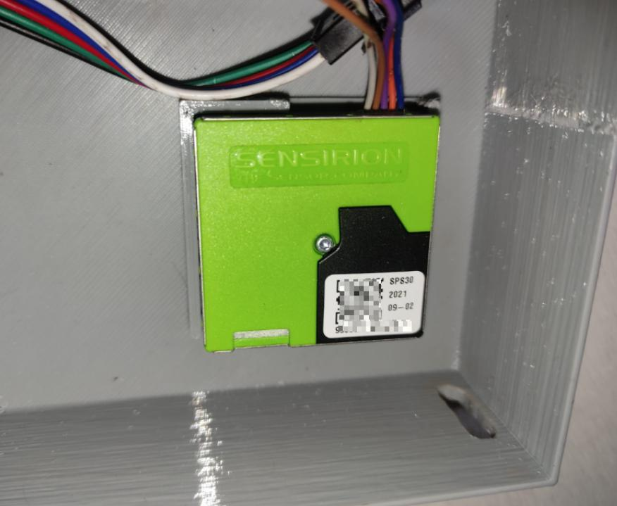

# [micropython-chaliuz-sps30](https://github.com/Chaliuz/sps30_micropypthon)



## Table of Contents
1. [Features](#Features)
2. [Examples](#Examples) <br>
    2.1 [Start/stop continuous measurement](#start_stop_measurement) <br>
3. [Notes](#Notes)
3. [License](#license)


## Features:<a name="Features"></a>
- This project uses a micropython class to control the SPS30 air quality sensor throw **UART** comm.
- SPS30 can use UART and I2C.
    - UART can transport the signal further distance compared to I2C.
    - I tested with 5m between the esp32 and SPS30 and the system works well.
- Methods implemented:
    - start continuous measurement.
    - stop continuous measurement.
    - clean fan.
- This project uses uasyncio.

- SPS30 sensor:
```
The sensirion SPS30 is an advanced, high-precision
particulate matter (PM) sensor designed to measure air
quality using laser scattering. Detects fine particles such
as PM1.0, PM2.5, PM4 and PM1O.
```


## Examples:<a name="Examples"></a>


### Start/stop measurement:<a name="start_stop_measurement"></a>
- Code:
```python
from libraries.sps30_uart import SPS30Uart
import uasyncio as asyncio

seconds = 0
sps30 = SPS30Uart(tx=16,rx=17)


async def main():

    # await sps30.clean_fan()

    seconds = 0
    while True:
        " start continuous measurement if not already initialized "
        current_measure = await sps30.read_measure()
        print("current_measure: ", current_measure)

        if seconds >= 8:
            await sps30.stop_continuous_measurement()
            break

        await asyncio.sleep(2)
        seconds += 2

asyncio.run(main())

# OUTPUT:
# iniciando sensor...
# iniciando medición continua...
# current_measure:  None
# current_measure:  {'2.5': 10.7, '10': 14.52, '1.0': 7.2, '4.0': 13.16}
# current_measure:  {'2.5': 11.15, '10': 12.82, '1.0': 9.26, '4.0': 12.22}
# current_measure:  {'2.5': 10.98, '10': 11.69, '1.0': 9.84, '4.0': 11.44}
# current_measure:  {'2.5': 11.34, '10': 12.04, '1.0': 10.18, '4.0': 11.79}
# medida continua detenida...
```

## Notes:<a name="Notes"></a>
- The sps30 takes a couple of seconds to start the continuous measurement.
- The clean fan takes near to 15 seconds. It consists of the SPS30 fan starting to work at
maximum power for about 12 seconds.

## Licence:<a name="license"></a>
MIT License
